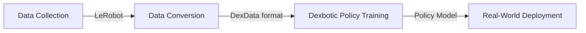
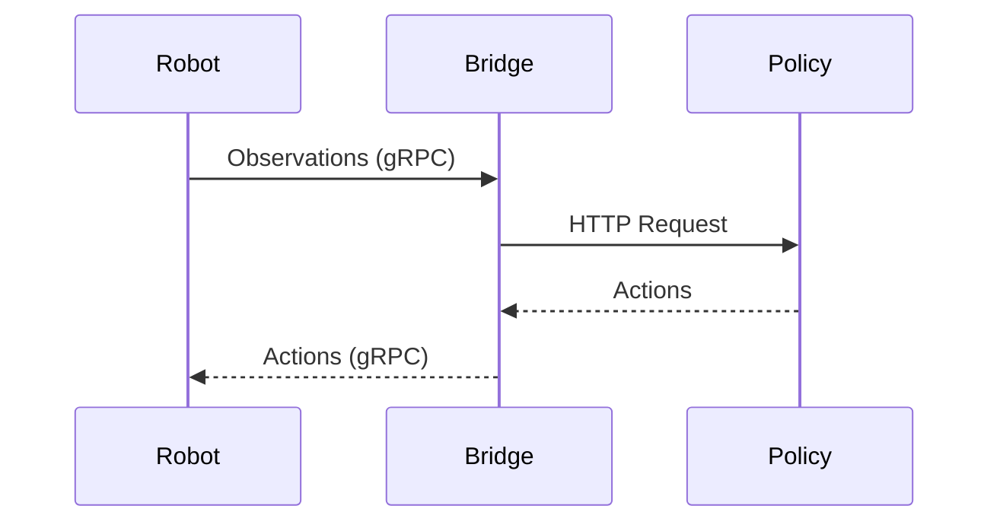

# 🚀 XLeRobot VLA Development Tutorial

Build a full robot control pipeline from data → training → real-world deployment using:

- Dexbotic toolbox
- [XLeRobot](https://github.com/Vector-Wangel/XLeRobot) (v0.4.0, dual-wheel version)

👉 This guide is designed to help you run the entire pipeline end-to-end from scratch

## Pipeline Overview

Before we begin, here’s what you will build:



## Inference Architecture

The XLeRobot inference system follows a decoupled, three-tier architecture:



## 🧩 Phase 0: Preparation

Follow the official XLeRobot documentation and complete:

1. Dual-wheel assembly
2. Install LeRobot
3. Dataset collection

## 🧩 Phase 1: Data Conversion (LeRobot → DexData)

🧠 What happens during the conversion?

- Align images, states, actions, and prompts
- Synchronize timestamps
- Split data into episodes

### 1. Input Data Structure (LeRobot)

```text
xlerobot-data/
└── <task_name>/                       # e.g. pick_longan_to_box
    ├── data/
    │   └── chunk-000/
    │       ├── file-000.parquet       # State/action data
    │       ├── file-001.parquet
    │       └── ...
    ├── meta/
    │   ├── episodes/
    │   │   └── chunk-000/
    │   │       ├── file-000.parquet   # Episode metadata
    │   │       ├── file-001.parquet
    │   │       └── ...
    │   ├── info.json                  # Dataset info (fps, features, paths)
    │   ├── stats.json
    │   └── tasks.parquet              # Task metadata (prompts)
    └── videos/
        ├── observation.images.head/
        │   └── chunk-000/
        │       ├── file-000.mp4
        │       └── ...
        ├── observation.images.wrist_left/
        │   └── chunk-000/
        │       ├── file-000.mp4
        │       └── ...
        └── observation.images.wrist_right/
            └── chunk-000/
                ├── file-000.mp4
                └── ...
```

### 2. Output Data Structure (DexData)

```text
xlerobot_dexdata/
├── jsonl/
│   └── <task_name>/
│       ├── episode_00000.jsonl
│       ├── episode_00001.jsonl
│       └── ...
└── videos/
    └── <task_name>/
        ├── episode_00000_head.mp4
        ├── episode_00000_wrist_left.mp4
        ├── episode_00000_wrist_right.mp4
        ├── episode_00001_head.mp4
        └── ...
```

### 3. Run Conversion

```bash
python convert_xlerobot_to_dexdata.py \
  --lerobot_dir /path/to/xlerobot-data/<task_name> \
  --output_dir /path/to/xlerobot_dexdata
```

## 🧩 Phase 2: Policy Training

### 1. Dataset Registration

Register your dataset in `dexbotic/data/data_source/xlerobot_<task>.py`:

```python
from dexbotic.data.data_source.register import register_dataset

XLEROBOT_DATASET = {
    "<task_name>": {
        "data_path_prefix": "/path/to/dexdata/videos",
        "annotations": "/path/to/dexdata/jsonl/<task_name>",
        "frequency": 1,
    },
}

meta_data = {
    'non_delta_mask': [5, 11, 12, 13, 14, 15],  # Non-delta action indices
    'periodic_mask': None,
    'periodic_range': None
}

register_dataset(XLEROBOT_DATASET, meta_data=meta_data, prefix='xlerobot')
```

> **Important:** The `non_delta_mask` `[5, 11, 12, 13, 14, 15]` corresponds to: Grippers (5, 11), Head Motors (12, 13), and Wheel Velocities (14, 15).

### 2. Create an Experiment Config

Create a config file:

```bash
playground/train_xlerobot_<your_task>.py
```

Required settings:

```python
# Dataset
DM0DataConfig.dataset_name = "your_task"
DM0DataConfig.num_images = 3
DM0DataConfig.images_keys = ["images_1", "images_2", "images_3"]  # head, wrist_left, wrist_right

# Training
DM0TrainerConfig.output_dir = "..."  # checkpoint/output directory

# Model
DM0ModelConfig.model_name_or_path = "..."  # pretrained model path

# Inference
DM0InferenceConfig.model_name_or_path = "..."  # finetuned checkpoint
DM0InferenceConfig.port = 7891
DM0InferenceConfig.non_delta_mask = [5, 11, 12, 13, 14, 15]  # must match dataset
DM0InferenceConfig.action_dim = 16  # XLeRobot action space
```

### 3. Training

```bash
cd dexbotic
deepspeed playground/train_xlerobot_<your_task>.py --task train
```

## 🧩 Phase 3: Real-World Deployment

**Terminal 1 — VLA Policy Server (GPU server / workstation)**:

```bash
cd dexbotic
python playground/train_xlerobot_<your_task>.py --task inference
```

**Terminal 2 — Bridge (on robot controller / edge device)**:

```bash
cd dexbotic
python hardware/xlerobot/bridge.py \
  --port 8080 \
  --vla_url http://127.0.0.1:7891 \
  --prompt "TASK_PROMPT" \
  --show_images
```

**Terminal 3 — Robot Client  (on robot controller / edge device)**:

```bash
cd lerobot
export SVT_LOG=1
python -m lerobot.async_inference.robot_client \
    --robot.type=xlerobot_2wheels \
    --robot.id=xler \
    --robot.port1=/dev/tty.usbmodem<SERIAL_1> \
    --robot.port2=/dev/tty.usbmodem<SERIAL_2> \
    --robot.cameras='your_camera_config_json' \
    --server_address=127.0.0.1:8080 \
    --policy_type=remote \
    --pretrained_name_or_path="none" \
    --actions_per_chunk=50 \
    --chunk_size_threshold=0.5 \
    --aggregate_fn_name=weighted_average \
    --fps=30
```

For detailed parameter descriptions, refer to the **[LeRobot Asynchronous Inference Documentation](https://huggingface.co/docs/lerobot/async)**.

> **Important:** Remember to add 'xlerobot_2wheels' to the `SUPPORTED_ROBOTS` list in `lerobot/async_inference/constants.py`.

## 🔥 FAQ

### Q1: Cameras not working

- Verify devices are detected:

  ```bash
  v4l2-ctl --list-devices
  ```
- Check if /dev/video* exists
- Ensure the device is not occupied:

  ```bash
  lsof /dev/video0
  ```
- Fix permission issues:

  ```bash
  sudo chmod 666 /dev/video0
  ```

### Q2: Robot fails to move

- The bridge is not connected to the VLA server

### Q3: Bad Inference

- Incorrect camera mapping
- Prompt mismatch (MOST COMMON)
- Incorrect non_delta_mask or action_dim
- Incorrect model checkpoint
- Camera moved (camera extrinsics changed)

### Q4: High latency

- Increase GPU performance
- Reduce resolution
- Reduce cameras

### Q5: Robot jittery (unstable or shaky motion)

- Control frequency mismatch
- FPS mismatch (sensor vs. control loop)
- Improper or missing action aggregation

### Q6: Optimization

- Collect more diverse data
- Improve data quality via noise filtering and outlier detection
- Ensure temporal alignment (action ↔ observation)
- Consider using the DM0 model

## Demos

Following the above instructions, we conducted a **Collect Longans into the Box** task on our XLeRobot robot, and provide a successful demo video below:

**[📹 View Demo Video: Collect Longans into the Box](../xlerobot/demo_collect_longans_into_the_box.mp4)**
